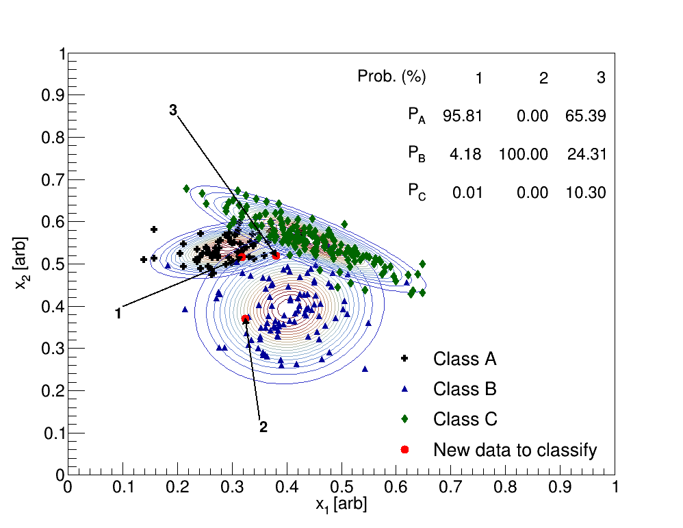

# Machine Learning Algorithms
* Requires CERN's ROOT package to be installed as it is used for plotting, random numbers, and other drawing features; the library may be downloaded <a href="https://root.cern.ch/download/root_v6.14.04.source.tar.gz">here</a>.

To run scripts within this directory, enter the root shell (simply type root -l in the terminal if installed) 
and run the following command:

.x name_of_script.cpp++

For example, if one wants to see the naive bayes classification code, change
directory to bayes_classifier, enter the root shell (type root in the terminal), and run this command:

.x bayes_classifier.cpp++

## Gaussian Naive Bayes Classification
* A full description may be found <a href="https://freddyox.github.io/blog/bayesian_classifier/">here</a>.

## K-Means Clustering
* A full description may be found <a href="https://freddyox.github.io/blog/Kmeans/">here</a>.

* A before-and-after comparison:

* K-Means clustering applied to Old Faithful data using python and scikit-learn (see website for more details):

